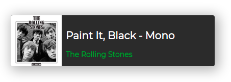

<p align="center">
  
</p>

# Spotify Current Song Widget

<p align="center">
  
</p>

[https://spotify-widget.vercel.app/](https://spotify-widget.vercel.app/)

A widget that shows what is currently playing on your spotify. It was built to be used with OBS Studio or Streamlabs OBS (or another broadcast application that accepts url sources). This way, whoever is watching your live, knows what music is playing.

## Development

### Requisites

- NodeJS
- An spotify app
- mongodb database

First, you should have a spotify app. You can create one [here](https://developer.spotify.com/dashboard/).

Second, you should have a mongodb database. I'm recommend you use [MongoDB Atlas](https://cloud.mongodb.com/).

After this, fill all enviroment variables in the `.env`

```
  DB_CONNECTION_STRING=your-mongodb-connection-string-with-user-and-pass
  ClientID=your-spotify-ClientID
  ClientSecret=your-spotify-ClientSecret
  BASE_URL=http://your-base-url/
```

Then, run the command below in your terminal

```bash
  yarn dev
```

Open [http://localhost:3000](http://localhost:3000) with your browser to see the result.

## TODO

- Tests

## Contributions

PR's are welcome!
